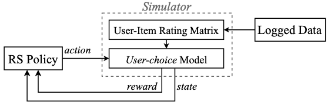
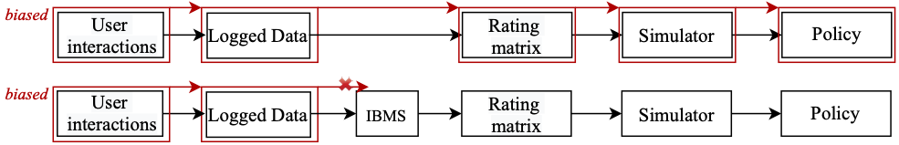

<!-- **Edit a file, create a new file, and clone from Bitbucket in under 2 minutes**

When you're done, you can delete the content in this README and update the file with details for others getting started with your repository.

*We recommend that you open this README in another tab as you perform the tasks below. You can [watch our video](https://youtu.be/0ocf7u76WSo) for a full demo of all the steps in this tutorial. Open the video in a new tab to avoid leaving Bitbucket.*

---

## Edit a file

You’ll start by editing this README file to learn how to edit a file in Bitbucket.

1. Click **Source** on the left side.
2. Click the README.md link from the list of files.
3. Click the **Edit** button.
4. Delete the following text: *Delete this line to make a change to the README from Bitbucket.*
5. After making your change, click **Commit** and then **Commit** again in the dialog. The commit page will open and you’ll see the change you just made.
6. Go back to the **Source** page.

---

## Create a file

Next, you’ll add a new file to this repository.

1. Click the **New file** button at the top of the **Source** page.
2. Give the file a filename of **contributors.txt**.
3. Enter your name in the empty file space.
4. Click **Commit** and then **Commit** again in the dialog.
5. Go back to the **Source** page.

Before you move on, go ahead and explore the repository. You've already seen the **Source** page, but check out the **Commits**, **Branches**, and **Settings** pages.

---

## Clone a repository

Use these steps to clone from SourceTree, our client for using the repository command-line free. Cloning allows you to work on your files locally. If you don't yet have SourceTree, [download and install first](https://www.sourcetreeapp.com/). If you prefer to clone from the command line, see [Clone a repository](https://confluence.atlassian.com/x/4whODQ).

1. You’ll see the clone button under the **Source** heading. Click that button.
2. Now click **Check out in SourceTree**. You may need to create a SourceTree account or log in.
3. When you see the **Clone New** dialog in SourceTree, update the destination path and name if you’d like to and then click **Clone**.
4. Open the directory you just created to see your repository’s files.

Now that you're more familiar with your Bitbucket repository, go ahead and add a new file locally. You can [push your change back to Bitbucket with SourceTree](https://confluence.atlassian.com/x/iqyBMg), or you can [add, commit,](https://confluence.atlassian.com/x/8QhODQ) and [push from the command line](https://confluence.atlassian.com/x/NQ0zDQ). -->

# SOFA
This repository is the implementation of [SOFA](https://staff.fnwi.uva.nl/m.derijke/wp-content/papercite-data/pdf/huang-2020-keeping.pdf), the Simulator for OFfline leArning and evaluation.
> Keeping Dataset Biases out of the Simulation: A Debiased Simulator for Reinforcement Learning based Recommender Systems. Jin Huang, Harrie Oosterhuis, Maarten de Rijke, Herke van Hoof. Recsys 2020.



The framework shows how RL4Rec typically interacts with a simulation-based environment. A state is user historical interactions, an action is an item being recommended bytheRS, and a reward is related to user feedback.

As a solution to the effect of bias present in logged data, we introduce a debiasing step in the simulation pipeline, which corrects for the biases present in the logged data before it is used to simulate user behavior.


<!-- ### Files in the folder -->

<!-- ### Required packages -->

## Running the code
```
$ cd examples
$ python run_dqn.py
```

## More details
We provide the details of DQN-based Policy used in experiments and the related hyperparamters (See [Appendix](https://github.com/BetsyHJ/SOFA/blob/master/appendix.pdf)).
And we also provide the [slide](https://github.com/BetsyHJ/SOFA/blob/master/recsys20-slides.pdf) used for presentation in recsys 2020.


## Cite
If you use our code, please cite our paper:
```
@inproceedings{huang2020keeping,
  title={Keeping Dataset Biases out of the Simulation: A Debiased Simulator for Reinforcement Learning based Recommender Systems},
  author={Huang, Jin and Oosterhuis, Harrie and de Rijke, Maarten and van Hoof, Herke},
  booktitle={Fourteenth ACM Conference on Recommender Systems},
  pages={190--199},
  year={2020}
}
```
